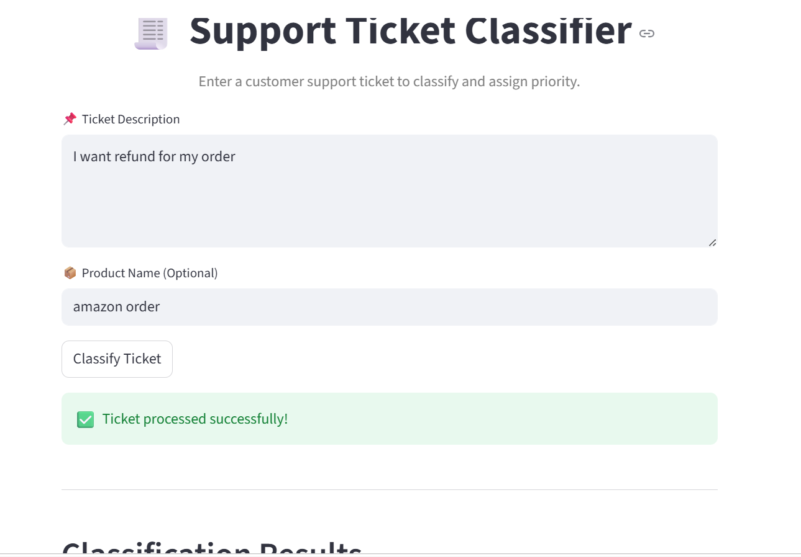

#  FUTURE_ML_02  
## Support Ticket Classifier

---

##  Project Description
This project is a simple **Machine Learning-based Support Ticket Classifier** built using Python and Streamlit. It classifies customer support tickets into categories such as:

-  Billing Issues  
-  Technical Issues  
-  Account Issues  

---
##  Objective
- Automate support ticket classification  
- Reduce manual effort  
- Demonstrate NLP + Machine Learning concepts  

---
##  Technologies Used
- Python  
- Streamlit  
- Pandas  
- Scikit-learn  

---

##  How It Works
1. User enters a support ticket description  
2. Text is converted into numbers using **CountVectorizer**  
3. Model (**Naive Bayes**) predicts the category  
4. Output is displayed instantly  

---

---

##  Example Inputs

| Ticket Description            | Output     |
|------------------------------|------------|
| Payment failed               | Billing    |
| App is not working           | Technical  |
| Cannot login to account      | Account    |

---

##  Output Screenshot

  

---

##  Algorithm Used
### Multinomial Naive Bayes
- Works well for text data  
- Fast and efficient  
- Based on probability  

---

##  Features
- Simple and user-friendly UI  
- Real-time prediction  
- Lightweight model  

---

##  Future Improvements
- Add priority prediction (High/Medium/Low)  
- Use advanced NLP models  
- Improve dataset for better accuracy  

---

##  Conclusion
This project shows how **Machine Learning and NLP** can automate customer support systems efficiently.

---

## 👩‍💻 Author
**Hema Sri**
